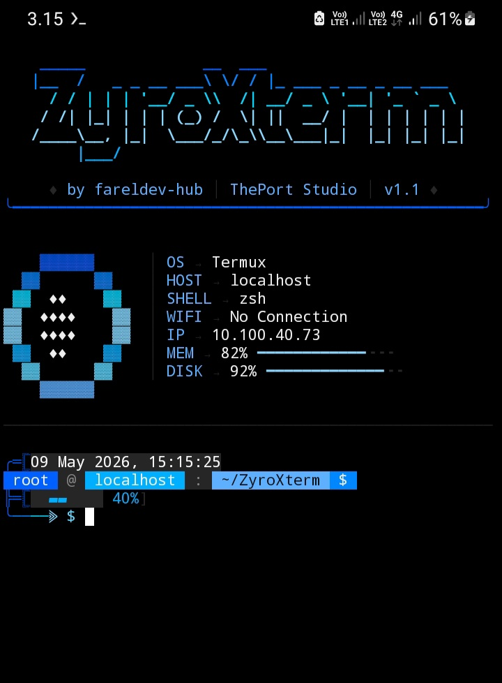
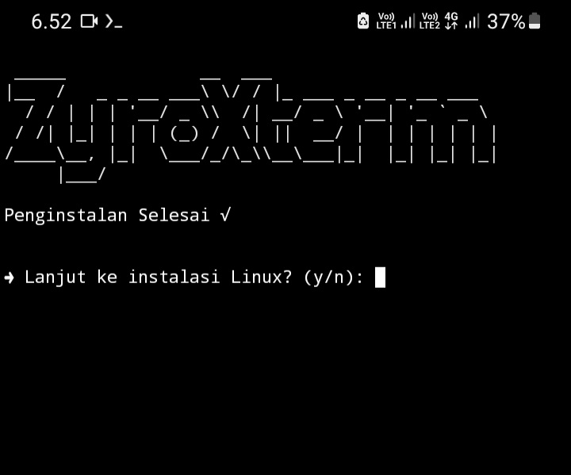
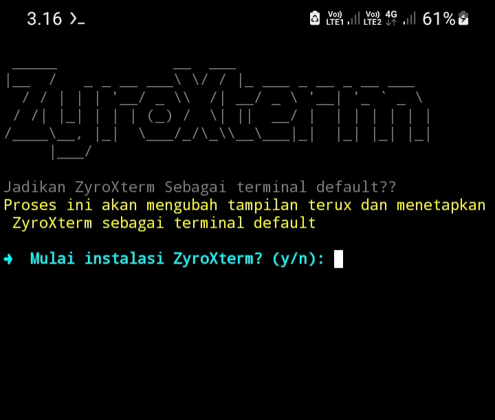
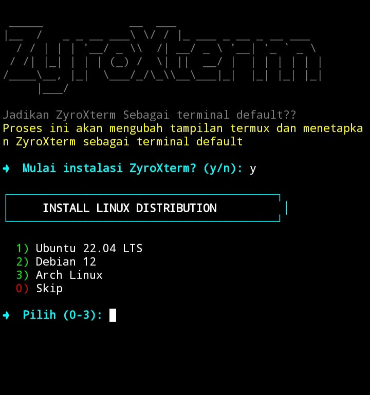
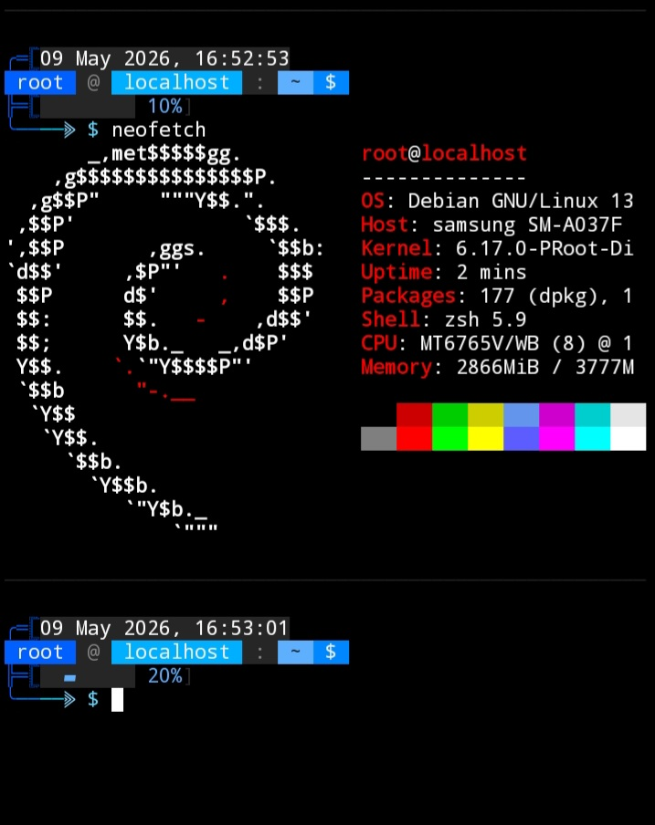

# ✨ ZYROXTERM 


<p align="center">
  
</p>

## 📌 Tentang ZyroXterm

ZyroXterm adalah tools untuk Termux yang dapat menjalan kan linux seperti debian, ubuntu dan arch linux serta memberikan tampilan terminal yg berbeda dari tampilan default termux, tools ini memiliki beberapa fitur command tambahan dan nyaman dipakai.

### 🛠️ Bahasa yang Digunakan

| Bahasa | Versi | Kegunaan |
|--------|-------|----------|
| **Shell Script (Bash)** | 5.x | Installer dan konfigurasi otomatis |
| **Python 3** | 3.x | Engine utama  dan warna |

## 🔧 Instalasi

```bash
# Pastikan Python 3
pkg install python python-pip
```

### Step-by-Step Instalasi

#### 1️⃣ Update & Upgrade Package

```bash
pkg update
```

```bash
pkg upgrade
```

```bash
pkg install git
```
```bash
git clone github.com/fareldev-hub/ZyroXterm.git
```
```bash
cd ZyroXterm
```

#### 2️⃣ Beri Izin Installer

```bash
termux-setup-storage
```
```bash
chmod +x install.sh
```

#### 3️⃣ Jalankan Installer

```bash
./install.sh
```

> ⏳ Tunggu prosesnya sampai selesai...

---

## 📸 Tahap Instalasi

### ✅ Tahap 1 - Konfirmasi Instalasi

Jika selesai, akan muncul tampilan seperti gambar berikut:

<p align="center">
  
</p>

> **Input:** Ketik `Y` untuk melanjutkan instalasi

---

### ✅ Tahap 2 - Startup 

Jika selesai, akan muncul tampilan seperti gambar berikut:

<p align="center">
  
</p>

> **Input:** Ketik `Y` untuk melanjutkan

---

### ✅ Tahap 23- Pilih Linux

Jika selesai, akan muncul tampilan seperti gambar berikut:

<p align="center">
  
</p>

> **Input:** kamu tinggal input ajaa dan pilih linux mana yg ingin kamu install untuk melanjutkan

---

## ✅ Selesai!

### Tema Telah Terpasang!

<p align="center">
  
</p>

## 🚀 Cara Penggunaan

Setelah instalasi selesai, **RESTART** Termux atau jalankan:

```bash
zsh
```

Setelah instalasi selesai, **JALANKAN LINUX** pada Termux menggunakan perintah:

## melihat linux yg tekah terinstall
```bash
ls
```

## untuk debian
```bash
chmod +x debian.sh
./debian.sh 
```
## untuk ubuntu
```bash
chmod +x ubuntu.sh
./ubuntu.sh 
```
## untuk arch linux
```bash
chmod +x arch.sh
./arxh.sh 
```

## Atau kamu bisa memanggilnya langsung
pastikan linux yg di panggil terlah terinstall
```bash
deb install
```
atau
```bash
debian run
```

selengkapnya Ketik :
```bash
help
```

<p align="center">
  
</p>


 akan aktif secara otomatis! 🎉

## 🔄 Uninstall

Menghapus ZyroXterm :

```bash
# Hapus folder 
rm -rf ~/.ZyroXterm

# Hapus konfigurasi dari .zshrc
nano ~/.zshrc  # Hapus bagian ZYROXTERM 
```

## 📝 Catatan Penting

> **⚠️ JANGAN HAPUS** folder `.ZyroXterm` karena berisi konfigurasi !
> 

## Troubleshooting

### Error: Python tidak ditemukan

```bash
pkg install python python-pip -y
```

### Error: ZSH tidak ditemukan

```bash
pkg install zsh -y
```

###  tidak muncul

```bash
# Cek apakah folder ada
ls -la ~/.ZyroXterm

## 📞 Kontak & Dukungan

- **GitHub**: [github.com/fareldev-hub/ZyroXterm](https://github.com/fareldev-hub/ZyroXterm)
- **Issues**: Laporkan bug di GitHub Issues
- **Version**: `1.1`

## 📜 Lisensi

Copyright © 2026 ZyroXterm

---

<p align="center">
  <b>Made with ❤️ by FarelDev</b><br>
  <i>Shell Script + Python 3</i>
</p>