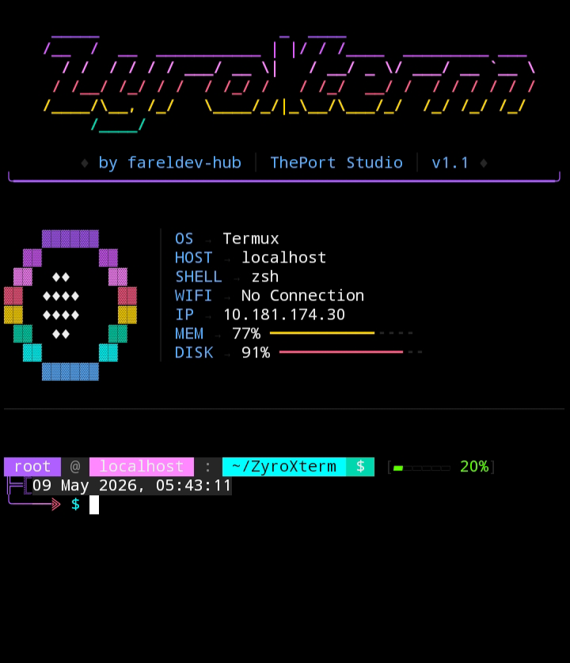
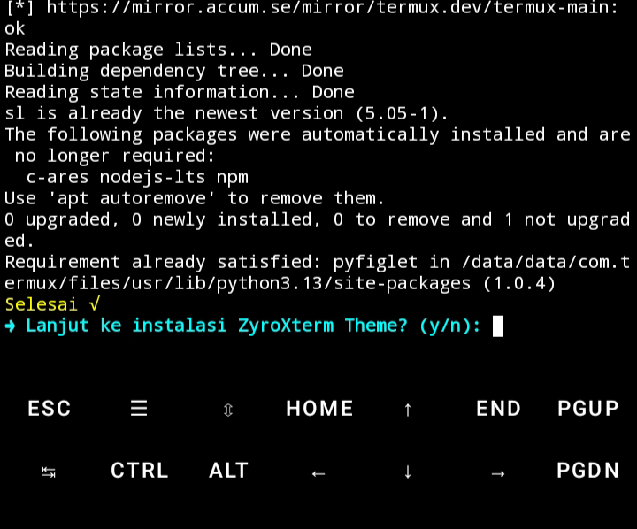

# ✨ ZYROXTERM THEME


<p align="center">
  
</p>

## 📌 Tentang ZyroXterm

ZyroXterm adalah theme aesthetic untuk Termux yang memberikan tampilan terminal modern dengan perpaduan warna neon khas. Theme ini akan mengubah tampilan prompt, warna teks, dan keseluruhan visual Termux menjadi lebih keren dan nyaman dipakai.

### 🛠️ Bahasa yang Digunakan

| Bahasa | Versi | Kegunaan |
|--------|-------|----------|
| 🐚 **Shell Script (Bash)** | 5.x | Installer dan konfigurasi otomatis |
| 🐍 **Python 3** | 3.x | Engine utama theme dan warna |

## 🎨 Fitur

| Fitur | Deskripsi |
|-------|-----------|
| 🎨 **Warna Neon** | Tampilan dengan warna cyan, ungu, dan hijau neon |
| ✨ **Prompt Keren** | Prompt aesthetic dengan icon dan gradien |
| 🚀 **Auto-Start** | Tema aktif otomatis setiap Termux dibuka |
| 💾 **Ringan** | Tidak memberatkan performa Termux |
| 🛡️ **Aman** | Tidak mengubah file sistem penting |
| 🎨 **16+ Warna** | Palette warna lengkap (Teal, Cyan, Violet, Pink, dll) |

## 🎨 Color Palette

```python
# ── Color Palette ZyroXterm ──
C_BLACK   = "#232"  # Hitam
C_DGRAY   = "#235"  # Abu gelap
C_GRAY    = "#240"  # Abu
C_MGRAY   = "#245"  # Abu medium
C_LGRAY   = "#250"  # Abu terang
C_WHITE   = "#255"  # Putih

C_TEAL    = "#43"   # Teal neon
C_CYAN    = "#51"   # Cyan terang
C_SKY     = "#75"   # Biru langit
C_BLUE    = "#69"   # Biru
C_VIOLET  = "#99"   # Violet
C_PURPLE  = "#135"  # Ungu
C_MAGENTA = "#171"  # Magenta
C_PINK    = "#213"  # Pink
C_ROSE    = "#204"  # Rose
C_RED     = "#196"  # Merah
C_ORANGE  = "#208"  # Oranye
C_GOLD    = "#220"  # Emas
C_YELLOW  = "#226"  # Kuning
C_LIME    = "#118"  # Limau
C_GREEN   = "#82"   # Hijau
```

## 🔧 Instalasi

### Prasyarat

<p align="center">
  
</p>

```bash
# Pastikan Python 3
pkg install python python-pip
```

### Step-by-Step Instalasi

#### 1️⃣ Update & Upgrade Package

```bash
pkg update
```

```bash
pkg upgrade
```

```bash
pkg install git
```
```bash
git clone github.com/fareldev-hub/ZyroXterm.git
```
```bash
cd ZyroXterm
```

#### 2️⃣ Beri Izin Installer

```bash
termux-setup-storage
```
```bash
chmod +x install.sh
```

#### 3️⃣ Jalankan Installer

```bash
./install.sh
```

> ⏳ Tunggu prosesnya sampai selesai...

---

## 📸 Tahap Instalasi

### ✅ Tahap 1 - Konfirmasi Instalasi

Jika selesai, akan muncul tampilan seperti gambar berikut:

<p align="center">
  
</p>

> **Input:** Ketik `Y` untuk melanjutkan instalasi

---

### ✅ Tahap 2 - Startup Theme

Jika selesai, akan muncul tampilan seperti gambar berikut:

<p align="center">
  
</p>

> **Input:** Ketik `Y` untuk melanjutkan

---

## ✅ Selesai!

### Tema Telah Terpasang!

<p align="center">
  
</p>

## 🚀 Cara Penggunaan

Setelah instalasi selesai, **RESTART** Termux atau jalankan:

```bash
zsh
```

Theme akan aktif secara otomatis! 🎉

## 🔄 Uninstall

Menghapus ZyroXterm Theme:

```bash
# Hapus folder theme
rm -rf ~/.ZyroXterm

# Hapus konfigurasi dari .zshrc
nano ~/.zshrc  # Hapus bagian ZYROXTERM THEME
```

## 📝 Catatan Penting

> **⚠️ JANGAN HAPUS** folder `.ZyroXterm` karena berisi konfigurasi theme!
> 
> **💡 TIPS**: Untuk melihat folder tersembunyi: `ls -la ~/.ZyroXterm`
> 
> **🎨 Info Versi**: System Version `1.1`

## 🐛 Troubleshooting

### Error: Python tidak ditemukan

```bash
pkg install python python-pip -y
```

### Error: ZSH tidak ditemukan

```bash
pkg install zsh -y
```

### Theme tidak muncul

```bash
# Cek apakah folder ada
ls -la ~/.ZyroXterm

# Manual load theme
python ~/.ZyroXterm/theme/main.py
```

## 📞 Kontak & Dukungan

- **GitHub**: [github.com/fareldev-hub/ZyroXterm](https://github.com/fareldev-hub/ZyroXterm)
- **Issues**: Laporkan bug di GitHub Issues
- **Version**: `1.1`

## 📜 Lisensi

Copyright © 2026 ZyroXterm

---

<p align="center">
  <b>Made with ❤️ by FarelDev</b><br>
  <i>Shell Script + Python 3</i>
</p>